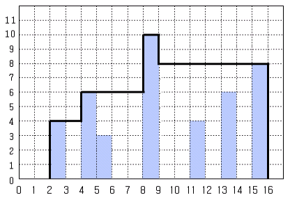

# 창고다각형

문제 설명
N개의 막대 기둥이 일렬로 세워져 있다. 기둥들의 폭은 모두 1m이며 높이는 다를 수 있다. 이 기둥들을 이용하여 양철로 된 창고를 제작하려고 한다. 창고에는 모든 기둥이 들어간다. 이 창고의 지붕을 다음과 같이 만들다.



(1) 지붕은 수평 부분과 수직 부분으로 구성되며, 모두 연결되어야 한다.
(2) 지붕의 수평 부분은 반드시 어떤 기둥의 윗면과 닿아야 한다.
(3) 지붕의 수직 부분은 반드시 어떤 기둥의 옆면과 닿아야 한다.
(4) 지붕의 가장자리는 땅에 닿아야 한다.
(5) 비가 올 때 물이 고이지 않도록 지붕의 어떤 부분도 오목하게 들어간 부분이 없어야 한다.

그림 1은 창고를 옆에서 본 모습을 그린 것이다. 이 그림에서 굵은 선으로 표시된 부분이 지붕에 해당 되고, 지붕과 땅으로 둘러싸인 다각형이 창고를 옆에서 본 모습이다. 이 다각형을 창고 다각형이라고 하자.


창고 주인은 창고 다각형의 면적이 가장 작은 창고를 만들기를 원한다. 그림 1에서 창고 다각형의 면적은 98㎡이고, 이 경우가 가장 작은 창고 다각형이다.
* C 제출은 다음 Template을 복사하여 코드를 작성하시오.

```cpp
#include <stdio.h>

int main(void)
{
      // 여기서부터 작성

      return 0;
}
```

입력
첫 줄에는 기둥의 개수를 나타내는 정수 N이 주어진다. N은 1이상 1,000 이하 이다. 그 다음 N개의 줄에는 각 줄의 기둥의 왼쪽 면의 위치를 나타내는 정수 L과 높이를 나타내는 정수 H가 한 개의 빈 칸을 사이에 두고 주어진다. L과 H는 둘 다 1 이상 1,000 이하 이다.
출력
첫 줄에 창고 다각형의 면적을 나타내는 정수를 출력한다.
입력 예시
7
2 4
11 4
15 8
4 6
5 3
8 10
13 6
출력 예시
98
